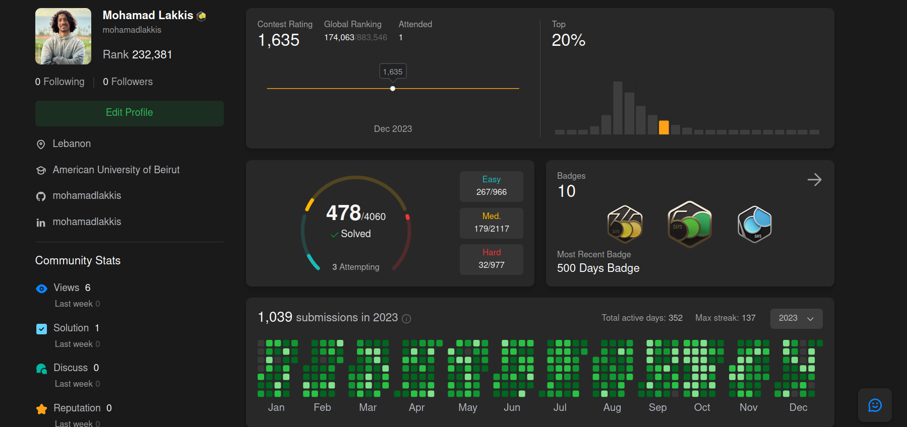

ML | STATISTICS | FINANCE | ECONOMICS

- 🔭 I’m currently working on Quantitative Finance 
- 💬 Ask me about: Statistics / ML / Financial Mathematics / Econometrics
- ☕ In Paris? Hit me up, let's grab a coffee 
- ⚡ Fav Quote: "Go the extra mile"

---

### 🧩 Algorithmic Problem Solving & Competitive Programming

- **LeetCode Highlights:**
  - **Consistency:** 500+ Days Active Badge | 352 Active Days in 2023
  - **Problems Solved:** 470+ problems solved across Data Structures, Dynamic Programming, and Graph Algorithms
- **Competitions:**
  - 🏆 **7th Place Nationally** — IEEE Xtreme 24-Hour Programming Competition
  - 🏆 **8th Place** — ICPC Regional Competition

 

### 📸 LeetCode Consistency Milestone (500+ Days Active)

<table>
  <tr>
    <td align="center"> 
      
    </td>
    <!-- <td align="center">
      
    </td> -->
  </tr>
</table> 

 

---

 &nbsp;  &nbsp; 
